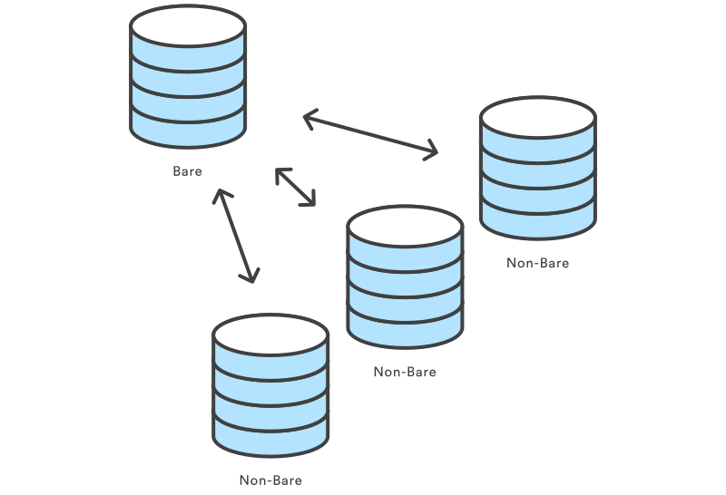
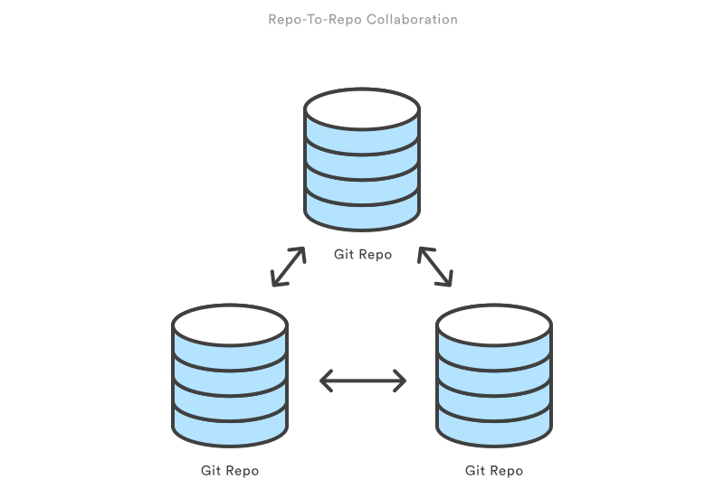

## Setting up a repository
### **`git init`**
1. **Usage**

    `git init`

    Transform the current directory into a Git repository. This adds a `.git` folder to the current directory and makes it possible to start recording revisions of the project.

    `git init <directory>`

    Create an empty Git repository in the specified directory. Running this command will create a new folder called `directory` containing nothing but the .git subdirectory.

    `git init --bare <directory>`

    Initialize an empty Git repository, but omit the working directory. Shared repositories should always be created with the `--bare` flag (see discussion below). Conventionally, repositories initialized with the `--bare` flag end in `.git`. For example, the bare version of a repository called `my-project` should be stored in a directory called `my-project.git`.

2. **Discussion**

    Compared to SVN, the `git init` command is an incredibly easy way to create new version-controlled projects. Git doesn’t require you to create a repository, import files, and check out a working copy. All you have to do is cd into your project folder and run `git init`, and you’ll have a fully functional Git repository.

    However, for most projects, `git init` only needs to be executed once to create a central repository—developers typically don‘t use git init to create their local repositories. Instead, they’ll usually use `git clone` to copy an existing repository onto their local machine.

3. **Bare Repositories**

    The `--bare` flag creates a repository that doesn’t have a working directory, making it impossible to edit files and commit changes in that repository. Central repositories should always be created as bare repositories because pushing branches to a non-bare repository has the potential to overwrite changes. Think of --bare as a way to mark a repository as a storage facility, opposed to a development environment. This means that for virtually all Git workflows, the central repository is bare, and developers local repositories are non-bare.

    

4. **Example**

    Since `git clone` is a more convenient way to create local copies of a project, the most common use case for `git init` is to create a central repository:
    ```bash
    ssh <user>@<host>
    cd path/above/repo
    git init --bare my-project.git
    ```
    First, you SSH into the server that will contain your central repository. Then, you navigate to wherever you’d like to store the project. Finally, you use the --bare flag to create a central storage repository. Developers would then clone `my-project.git` to create a local copy on their development machine.

### `git clone`

The `git clone` command copies an existing Git repository. This is sort of like svn checkout, except the “working copy” is a full-fledged Git repository—it has its own history, manages its own files, and is a completely isolated environment from the original repository.

As a convenience, cloning automatically creates a remote connection called `origin` pointing back to the original repository. This makes it very easy to interact with a central repository.

1. **Usage**

    `git clone <repo>`

    Clone the repository located at `<repo>` onto the local machine. The original repository can be located on the local filesystem or on a remote machine accessible via HTTP or SSH.

    `git clone <repo> <directory>`

    Clone the repository located at `<repo>` into the folder called `<directory>` on the local machine.

2. **Discussion**

    If a project has already been set up in a central repository, the `git clone` command is the most common way for users to obtain a development copy. Like git init, cloning is generally a one-time operation—once a developer has obtained a working copy, all version control operations and collaborations are managed through their local repository.

3. **Repo-To-Repo Collaboration**

    It’s important to understand that Git’s idea of a “working copy” is very different from the working copy you get by checking out code from an SVN repository. Unlike SVN, Git makes no distinction between the working copy and the central repository—they are all full-fledged Git repositories.

    This makes collaborating with Git fundamentally different than with SVN. Whereas SVN depends on the relationship between the central repository and the working copy, Git’s collaboration model is based on repository-to-repository interaction. Instead of checking a working copy into SVN’s central repository, you `push` or `pull` commits from one repository to another.
<br/>
    Of course, there’s nothing stopping you from giving certain Git repos special meaning. For example, by simply designating one Git repo as the “central” repository, it’s possible to replicate a **Centralized workflow** using Git. The point is, this is accomplished through conventions rather than being hardwired into the VCS itself.

4. **Example**

    The example below demonstrates how to obtain a local copy of a central repository stored on a server accessible at example.com using the SSH username john:
    ```bash
    git clone ssh://john@example.com/path/to/my-project.git
    cd my-project
    # Start working on the project
    ```
    The first command initializes a new Git repository in the my-project folder on your local machine and populates it with the contents of the central repository. Then, you can cd into the project and start editing files, committing snapshots, and interacting with other repositories. Also note that the .git extension is omitted from the cloned repository. This reflects the non-bare status of the local copy.

### `git config`

The `git config` command lets you configure your Git installation (or an individual repository) from the command line. This command can define everything from user info to preferences to the behavior of a repository. Several common configuration options are listed below.

1. **Usage**

    `git config user.name <name>`

    Define the author name to be used for all commits in the current repository. Typically, you’ll want to use the `--global` flag to set configuration options for the current user.

    Define the author name to be used for all commits by the current user.

    `git config --global user.name <name>`

    Define the author email to be used for all commits by the current user.

    `git config --global user.email <email>`

    Create a shortcut for a Git command.

    `git config --global alias.<alias-name> <git-command>`

    Create a shortcut for a Git command.

    `git config --global alias.<alias-name> <git-command>`

    Define the text editor used by commands like git commit for all users on the current machine. The `<editor>` argument should be the command that launches the desired editor (e.g., vi).

    `git config --system core.editor <editor>`

    Open the global configuration file in a text editor for manual editing.

    `git config --global --edit`

2. **Discussion**

    All configuration options are stored in plaintext files, so the git config command is really just a convenient command-line interface. Typically, you’ll only need to configure a Git installation the first time you start working on a new development machine, and for virtually all cases, you’ll want to use the `--global` flag.

    Git stores configuration options in three separate files, which lets you scope options to individual repositories, users, or the entire system:
  + `<repo>/.git/config` – Repository-specific settings.

  + `~/.gitconfig` – User-specific settings. This is where options set with the `--global` flag are stored.

  + `$(prefix)/etc/gitconfig` – System-wide settings.

  When options in these files conflict, local settings override user settings, which override system-wide. If you open any of these files, you’ll see something like the following:
    ```bash
    [user]
name = John Smith
email = john@example.com
[alias]
st = status
co = checkout
br = branch
up = rebase
ci = commit
[core]
editor = vim
    ```
    You can manually edit these values to the exact same effect as `git config`.

3. **Example**

    The first thing you’ll want to do after installing Git is tell it your name/email and customize some of the default settings. A typical initial configuration might look something like the following:

    ```bash
    # Tell Git who you are
git config --global user.name "John Smith"
git config --global user.email john@example.com
    ```

    ```bash
    # Select your favorite text editor
git config --global core.editor vim
    ```

    ```bash
    # Add some SVN-like aliases
git config --global alias.st status
git config --global alias.co checkout
git config --global alias.br branch
git config --global alias.up rebase
git config --global alias.ci commit
    ```
This will produce the `~/.gitconfig` file from the previous section.
