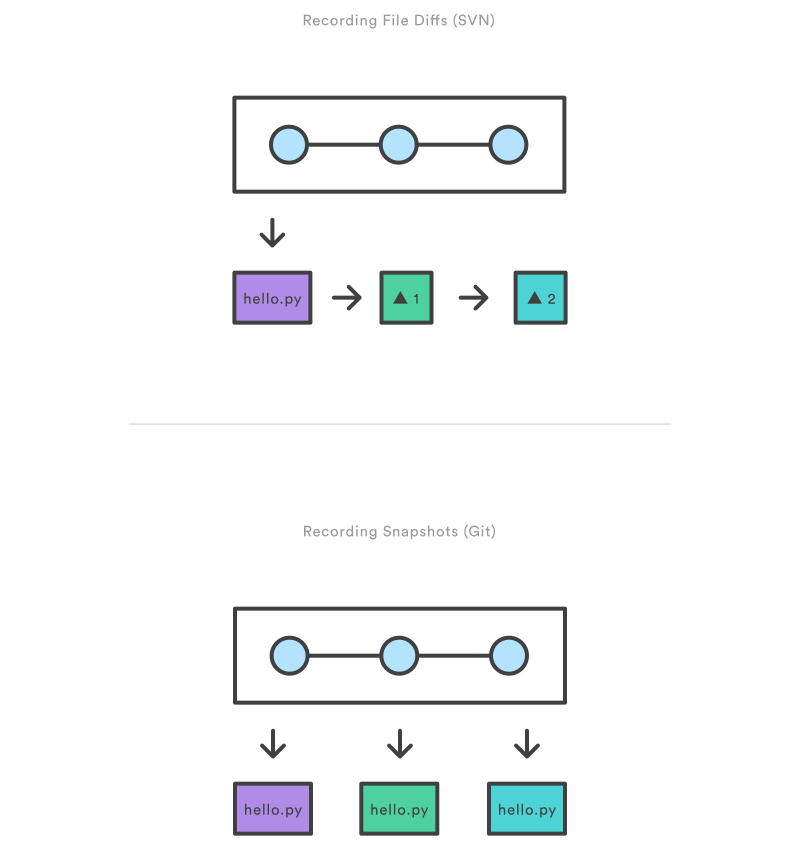

## Saving changes
### **`git add`**
The `git add` command adds a change in the working directory to the staging area. It tells Git that you want to include updates to a particular file in the next commit. However, `git add` doesn't really affect the repository in any significant way—changes are not actually recorded until you run `git commit`.

In conjunction with these commands, you'll also need `git status` to view the state of the working directory and the staging area.

1. **Usage**

    `git add <file>`

    Stage all changes in `<file>` for the next commit.

    `git add <directory>`

    Stage all changes in `<directory>` for the next commit.

    `git add -p`

    Begin an interactive staging session that lets you choose portions of a file to add to the next commit. This will present you with a chunk of changes and prompt you for a command.

    Use **`y`** to stage the chunk,**`n`** to ignore the chunk, **`s`** to split it into smaller chunks, **`e`** to manually edit the chunk, and **`q`** to exit.

2. **Discussion**

    The `git add` and `git commit` commands compose the fundamental Git workflow. These are the two commands that every Git user needs to understand, regardless of their team’s collaboration model. They are the means to record versions of a project into the repository’s history.

    Developing a project revolves around the basic `edit/stage/commit` pattern. First, you edit your files in the working directory. When you’re ready to save a copy of the current state of the project, you `stage changes` with `git add`. After you’re happy with the staged snapshot, you commit it to the project history with `git commit`.

    The `git add` command should not be confused with `svn add`, which adds a file to the repository. Instead, `git add` works on the more abstract level of *changes*. This means that `git add` needs to be called every time you alter a file, whereas svn add only needs to be called once for each file. It may sound redundant, but this workflow makes it much easier to keep a project organized.

    **The Staging Area**

    The staging area is one of Git's more unique features, and it can take some time to wrap your head around it if you’re coming from an SVN (or even a Mercurial) background. It helps to think of it as a buffer between the working directory and the project history.

    Instead of committing all of the changes you've made since the last commit, the stage lets you group related changes into highly focused snapshots before actually committing it to the project history. This means you can make all sorts of edits to unrelated files, then go back and split them up into logical commits by adding related changes to the stage and commit them piece-by-piece. As in any revision control system, it’s important to create atomic commits so that it’s easy to track down bugs and revert changes with minimal impact on the rest of the project.

3. **Example**

    When you’re starting a new project, `git add` serves the same function as `svn import`. To create an initial commit of the current directory, use the following two commands:
    ```bash
    git add .
    git commit
    ```

    Once you’ve got your project up-and-running, new files can be added by passing the path to `git add`:
    ```bash
    git add hello.py
    git commit
    ```

    The above commands can also be used to record changes to existing files. Again, Git doesn’t differentiate between staging changes in new files vs. changes in files that have already been added to the repository.


### **`git commit`**
The `git commit` command commits the staged snapshot to the project history. Committed snapshots can be thought of as “safe” versions of a project—Git will never change them unless you explicity ask it to. Along with `git add`, this is one of the most important Git commands.

While they share the same name, this command is nothing like `svn commit`. Snapshots are committed to the local repository, and this requires absolutely no interaction with other Git repositories.

1. **Usage**

    `git commit`

    Commit the staged snapshot. This will launch a text editor prompting you for a commit message. After you’ve entered a message, save the file and close the editor to create the actual commit.

    `git commit -m "<message>"`

    Commit the staged snapshot, but instead of launching a text editor, use `<message`> as the commit message.

    `git commit -a`

    Commit a snapshot of all changes in the working directory. This only includes modifications to tracked files (those that have been added with `git add` at some point in their history).

2. **Discussion**

    Snapshots are always committed to the *local* repository. This is fundamentally different from SVN, wherein the working copy is committed to the central repository. In contrast, Git doesn’t force you to interact with the central repository until you’re ready. Just as the staging area is a buffer between the working directory and the project history, each developer’s local repository is a buffer between their contributions and the central repository.

    This changes the basic development model for Git users. Instead of making a change and committing it directly to the central repo, Git developers have the opportunity to accumulate commits in their local repo. This has many advantages over SVN-style collaboration: it makes it easier to split up a feature into atomic commits, keep related commits grouped together, and clean up local history before publishing it to the central repository. It also lets developers work in an isolated environment, deferring integration until they’re at a convenient break point.

    **Snapshots, Not Differences**

    Aside from the practical distinctions between SVN and Git, their underlying implementation also follow entirely divergent design philosophies. Whereas SVN tracks differences of a file, Git’s version control model is based on **snapshots**. For example, an SVN commit consists of a diff compared to the original file added to the repository. Git, on the other hand, records the entire contents of each file in every commit.
    

    This makes many Git operations much faster than SVN, since a particular version of a file doesn’t have to be “assembled” from its diffs—the complete revision of each file is immediately available from Git's internal database.

    Git's snapshot model has a far-reaching impact on virtually every aspect of its version control model, affecting everything from its branching and merging tools to its collaboration workflows.

3. **Example**

    The following example assumes you’ve edited some content in a file called `hello.py` and are ready to commit it to the project history. First, you need to stage the file with `git add`, then you can commit the staged snapshot.
    ```bash
    git add hello.py
    git commit
    ```

    This will open a text editor (customizable via `git config`) asking for a commit message, along with a list of what’s being committed:
    ```bash
# Please enter the commit message for your changes. Lines starting
# with '#' will be ignored, and an empty message aborts the commit.
# On branch master
# Changes to be committed:
# (use "git reset HEAD <file>..." to unstage)
#
#modified: hello.py
```

    Git doesn't require commit messages to follow any specific formatting constraints, but the canonical format is to summarize the entire commit on the first line in less than 50 characters, leave a blank line, then a detailed explanation of what’s been changed. For example:
    ```bash
    Change the message displayed by hello.py
    - Update the sayHello() function to output the user's name
    - Change the sayGoodbye() function to a friendlier message
    ```

    Note that many developers also like to use present tense in their commit messages. This makes them read more like actions on the repository, which makes many of the history-rewriting operations more intuitive.

