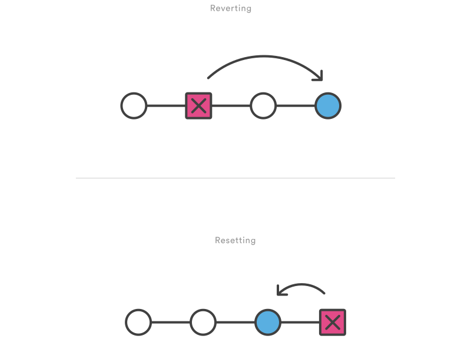
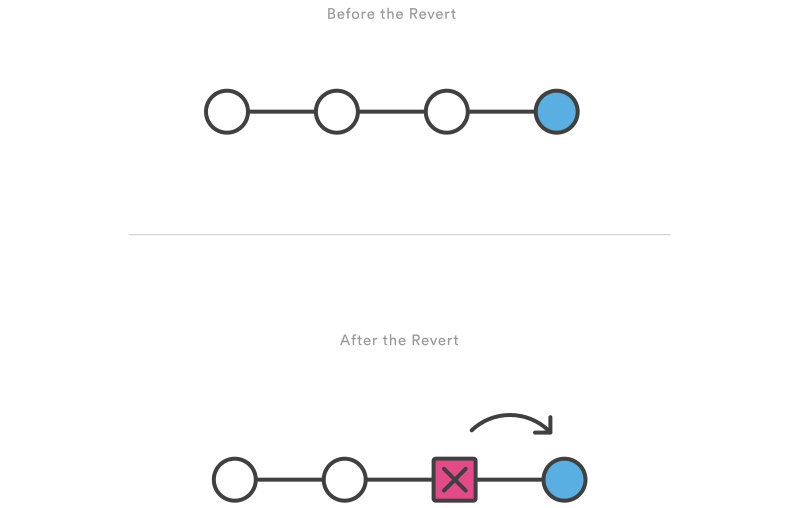
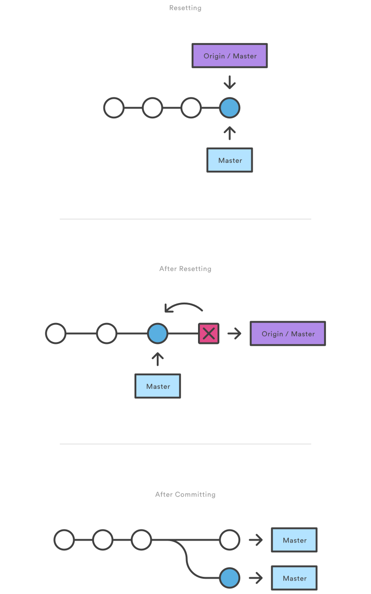

## Undoing Changes

This tutorial provides all of the necessary skills to work with previous revisions of a software project. First, it shows you how to explore old commits, then it explains the difference between reverting public commits in the project history vs. resetting unpublished changes on your local machine.
### `git revert`
The `git revert` command undoes a committed snapshot. But, instead of removing the commit from the project history, it figures out how to undo the changes introduced by the commit and appends a new commit with the resulting content. This prevents Git from losing history, which is important for the integrity of your revision history and for reliable collaboration.


1. **Usage**

    `git revert <commit>`

    Generate a new commit that undoes all of the changes introduced in `<commit>`, then apply it to the current branch.

2. **Discussion**

    Reverting should be used when you want to remove an entire commit from your project history. This can be useful, for example, if you’re tracking down a bug and find that it was introduced by a single commit. Instead of manually going in, fixing it, and committing a new snapshot, you can use git revert to automatically do all of this for you.

    **Reverting vs. Resetting**

    It's important to understand that `git revert` undoes a single commit—it does not “revert” back to the previous state of a project by removing all subsequent commits. In Git, this is actually called a `reset`, not a `revert`.


    Reverting has two important advantages over resetting. First, it doesn’t change the project history, which makes it a “safe” operation for commits that have already been published to a shared repository. For details about why altering shared history is dangerous, please see the `git reset` page.

    Second, `git revert` is able to target an individual commit at an arbitrary point in the history, whereas `git reset` can only work backwards from the current commit. For example, if you wanted to undo an old commit with `git reset`, you would have to remove all of the commits that occurred after the target commit, remove it, then re-commit all of the subsequent commits. Needless to say, this is not an elegant undo solution.

3. **Example**

    The following example is a simple demonstration of `git revert`. It commits a snapshot, then immediately undoes it with a revert.

    ```bash
    # Edit some tracked files

    # Commit a snapshot
    git commit -m "Make some changes that will be undone"

    # Revert the commit we just created
    git revert HEAD
    ```

    This can be visualized as the following:

<br/>
<br/>
    Note that the 4th commit is still in the project history after the revert. Instead of deleting it, git revert added a new commit to undo its changes. As a result, the 3rd and 5th commits represent the exact same code base, and the 4th commit is still in our history just in case we want to go back to it down the road.

### **`git reset`**
If `git revert` is a “safe” way to undo changes, you can think of `git reset` as the dangerous method.

When you undo with `git reset`(and the commits are no longer referenced by any ref or the reflog), there is no way to retrieve the original copy —it is a **permanent** undo. Care must be taken when using this tool, as it’s one of the only Git commands that has the potential to lose your work.

Like `git checkout`, `git reset` is a versatile command with many configurations. It can be used to remove committed snapshots, although it’s more often used to undo changes in the staging area and the working directory. In either case, it should only be used to undo local changes—you should never reset snapshots that have been shared with other developers.

1. **Usage**

    `git reset <file>`

    Remove the specified file from the staging area, but leave the working directory unchanged. This unstages a file without overwriting any changes.

    `git reset`

    Reset the staging area to match the most recent commit, but leave the working directory unchanged. This unstages **all** files without overwriting any changes, giving you the opportunity to re-build the staged snapshot from scratch.

    `git reset --hard`

    Reset the staging area and the working directory to match the most recent commit. In addition to unstaging changes, the `--hard` flag tells Git to overwrite all changes in the working directory, too. Put another way: this **obliterates** all uncommitted changes, so make sure you really want to throw away your local developments before using it.

    `git reset <commit>`

    Move the current branch tip backward to `<commit>`, reset the staging area to match, but leave the working directory alone. All changes made since `<commit>` will reside in the working directory, which lets you re-commit the project history using cleaner, more atomic snapshots.

    `git reset --hard <commit>`

    Move the current branch tip backward to `<commit>` and reset both the staging area and the working directory to match. This obliterates not only the uncommitted changes, but all commits after `<commit>`, as well.

2. **Discussion**

    All of the above invocations are used to remove changes from a repository. Without the `--hard` flag, `git reset` is a way to clean up a repository by unstaging changes or uncommitting a series of snapshots and re-building them from scratch. The `--hard` flag comes in handy when an experiment has gone horribly wrong and you need a clean slate to work with.

    Whereas reverting is designed to safely undo a **public** commit, git reset is designed to undo **local** changes. Because of their distinct goals, the two commands are implemented differently: **resetting** completely removes a changeset, whereas **reverting** maintains the original changeset and uses a new commit to apply the undo.


    **Don’t Reset Public History**

    You should never use git reset `<commit>` when any snapshots after `<commit>` have been pushed to a public repository. After publishing a commit, you have to assume that other developers are reliant upon it.

    Removing a commit that other team members have continued developing poses serious problems for collaboration. When they try to sync up with your repository, it will look like a chunk of the project history abruptly disappeared. The sequence below demonstrates what happens when you try to reset a public commit. The `origin/master` branch is the central repository’s version of your local `master` branch.


    As soon as you add new commits after the reset, Git will think that your local history has diverged from origin/master, and the merge commit required to synchronize your repositories is likely to confuse and frustrate your team.

    The point is, make sure that you’re using git `reset <commit>` on a local experiment that went wrong—not on published changes. If you need to fix a public commit, the `git revert` command was designed specifically for this purpose.

3. **Examples**

    **Unstaging a File**

    The `git reset` command is frequently encountered while preparing the staged snapshot. The next example assumes you have two files called `hello.py` and `main.py` that you’ve already added to the repository.

    ```bash
    # Edit both hello.py and main.py

    # Stage everything in the current directory
    git add .

    # Realize that the changes in hello.py and main.py
    # should be committed in different snapshots

    # Unstage main.py
    git reset main.py

    # Commit only hello.py
    git commit -m "Make some changes to hello.py"

    # Commit main.py in a separate snapshot
    git add main.py
    git commit -m "Edit main.py"
    ```

    As you can see, `git reset` helps you keep your commits highly-focused by letting you unstage changes that aren’t related to the next commit.

    **Removing Local Commits**

    The next example shows a more advanced use case. It demonstrates what happens when you’ve been working on a new experiment for a while, but decide to completely throw it away after committing a few snapshots.

    ```bash
    # Create a new file called `foo.py` and add some code to it

    # Commit it to the project history
    git add foo.py
    git commit -m "Start developing a crazy feature"

    # Edit `foo.py` again and change some other tracked files, too

    # Commit another snapshot
    git commit -a -m "Continue my crazy feature"

    # Decide to scrap the feature and remove the associated commits
    git reset --hard HEAD~2
    ```

    The `git reset HEAD~2` command moves the current branch backward by two commits, effectively removing the two snapshots we just created from the project history. Remember that this kind of reset should only be used on **unpublished** commits. Never perform the above operation if you’ve already pushed your commits to a shared repository.

###`git clean`
The `git clean` command removes untracked files from your working directory. This is really more of a convenience command, since it’s trivial to see which files are untracked with `git status` and remove them manually. Like an ordinary `rm` command, `git clean` is **not** undoable, so make sure you really want to delete the untracked files before you run it.

The `git clean` command is often executed in conjunction with `git reset --hard`. Remember that resetting only affects tracked files, so a separate command is required for cleaning up untracked ones. Combined, these two commands let you return the working directory to the exact state of a particular commit.

1. **Usage**

    `git clean -n`

    Perform a “dry run” of git clean. This will show you which files are going to be removed without actually doing it.

    `git clean -f`

    Remove untracked files from the current directory. The `-f` (force) flag is required unless the `clean.requireForce` configuration option is set to `false` (it's `true` by default). This will not remove untracked folders or files specified by `.gitignore`.

    `git clean -f <path>`

    Remove untracked files, but limit the operation to the specified path.

    `git clean -df`

    Remove untracked files and untracked directories from the current directory.

    `git clean -xf`

    Remove untracked files from the current directory as well as any files that Git usually ignores.

2. **Discussion**

    The `git reset --hard` and `git clean -f` commands are your best friends after you’ve made some embarrassing developments in your local repository and want to burn the evidence. Running both of them will make your working directory match the most recent commit, giving you a clean slate to work with.

    The `git clean` command can also be useful for cleaning up the working directory after a build. For example, it can easily remove the `.o` and `.exe` binaries generated by a C compiler. This is occasionally a necessary step before packaging a project for release. The `-x` option is particularly convenient for this purpose.

    Keep in mind that, along with `git reset`, `git clean` is one of the only Git commands that has the potential to permanently delete commits, so be careful with it. In fact, it’s so easy to lose important additions that the Git maintainers require the `-f` flag for even the most basic operations. This prevents you from accidentally deleting everything with a naive `git clean` call.

3. **Example**

    The following example obliterates all changes in the working directory, including new files that have been added. It assumes you’ve already committed a few snapshots and are experimenting with some new developments.

    ```bash
    # Edit some existing files
    # Add some new files
    # Realize you have no idea what you're doing

    # Undo changes in tracked files
    git reset --hard

    # Remove untracked files
    git clean -df
    ```

    After running this reset/clean sequence, the working directory and the staging area will look exactly like the most recent commit, and `git status` will report a clean working directory. You're now ready to begin again.

Note that, unlike the second example in `git reset`, the new files were *not* added to the repository. As a result, they could not be affected by `git reset --hard`, and `git clean` was required to delete them.


