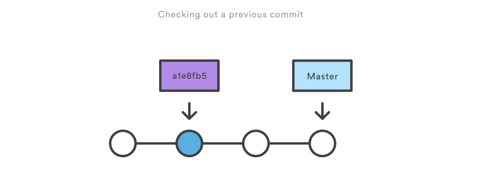

## Viewing old commits
### **`git checkout`**
The `git checkout` command serves three distinct functions:
+ checking out files
+ checking out commits,
+ and checking out branches.

In this module, we’re only concerned with the first two configurations.

Checking out a commit makes the entire working directory match that commit. This can be used to view an old state of your project without altering your current state in any way. Checking out a file lets you see an old version of that particular file, leaving the rest of your working directory untouched.

1. **Usage**

    ```bash
git checkout master
    ```

    Return to the master branch. Branches are covered in depth in the next module, but for now, you can just think of this as a way to get back to the “current” state of the project.

    ```bash
git checkout <commit> <file>
    ```

    Check out a previous version of a file. This turns the <file> that resides in the working directory into an exact copy of the one from <commit> and adds it to the staging area.

    ```bash
    git checkout <commit>
    ```

    Update all files in the working directory to match the specified commit. You can use either a commit hash or a tag as the `<commit>` argument. This will put you in a detached HEAD state.

2. **Discussion**

    The whole idea behind any version control system is to store “safe” copies of a project so that you never have to worry about irreparably breaking your code base. Once you’ve built up a project history, `git checkout` is an easy way to “load” any of these saved snapshots onto your development machine.

    Checking out an old commit is a read-only operation. It’s impossible to harm your repository while viewing an old revision. The “current” state of your project remains untouched in the master branch (see the Branches Module for details). During the normal course of development, the HEAD usually points to master or some other local branch, but when you check out a previous commit, HEAD no longer points to a branch—it points directly to a commit. This is called a “detached HEAD” state, and it can be visualized as the following:
    

    On the other hand, checking out an old file does affect the current state of your repository. You can re-commit the old version in a new snapshot as you would any other file. So, in effect, this usage of git checkout serves as a way to revert back to an old version of an individual file.


3. **Example**

    **Viewing an Old Revision**

    This example assumes that you’ve started developing a crazy experiment, but you’re not sure if you want to keep it or not. To help you decide, you want to take a look at the state of the project before you started your experiment. First, you’ll need to find the ID of the revision you want to see.

    ```bash
    git log --oneline
    ```

    Let’s say your project history looks something like the following:

    ```bash
b7119f2 Continue doing crazy things
872fa7e Try something crazy
a1e8fb5 Make some important changes to hello.py
435b61d Create hello.py
9773e52 Initial import
    ```

    You can use `git checkout` to view the “Make some import changes to hello.py” commit as follows:

    ```bash
git checkout a1e8fb5
    ```

    This makes your working directory match the exact state of the a1e8fb5 commit. You can look at files, compile the project, run tests, and even edit files without worrying about losing the current state of the project. **Nothing** you do in here will be saved in your repository. To continue developing, you need to get back to the “current” state of your project:

    ```bash
git checkout master
    ```

    This assumes that you're developing on the default master branch, which will be thoroughly discussed in the Branches Module.

    **Checking Out a File**

    If you’re only interested in a single file, you can also use `git checkout` to fetch an old version of it. For example, if you only wanted to see the `hello.py` file from the old commit, you could use the following command:

    ```bash
git checkout a1e8fb5 hello.py
    ```

    Remember, unlike checking out a commit, this **does** affect the current state of your project. The old file revision will show up as a “Change to be committed,” giving you the opportunity to revert back to the previous version of the file. If you decide you don’t want to keep the old version, you can check out the most recent version with the following:
    ```bash
git checkout HEAD hello.py
    ```
