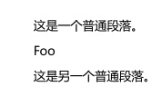

# MarkDown 简介

Markdown 的目标是实现**「易读易写」**。

Markdown 具有以下特点：

**1\. 简单明了**<br>
Markdown 的语法全由一些符号所组成，这些符号经过精挑细选，作用一目了然。

**2\. 兼容 HTML**<br>
HTML 是一种发布的格式，Markdown 是一种书写的格式。鉴于此，Markdown 的格式语法只涵盖纯文本可以涵盖的范围
  - 在 Markdown 涵盖范围之内的标签，都可以直接在文档里面用 HTML 撰写。不需要额外标注这是 HTML 或是 Markdown；**只要直接加标签就可以了**。

  - 要制约的只有一些 HTML 区块元素――比如 `<div>`、`<table>`、`<pre>`、`<p>` 等标签，必须在前后加上空行与其它内容区隔开，还要求它们的开始标签与结尾标签不能用制表符或空格来缩进。Markdown 的生成器有足够智能，不会在 HTML 区块标签外加上不必要的 `<p>` 标签。
例如：

```
这是一个普通段落。

<table>
    <tr>
        <td>Foo</td>
    </tr>
</table>

这是另一个普通段落。

```

&emsp;&emsp;效果如下：



  - HTML 的区段（行内）标签如 `<span>`、`<cite`>、`<del>` 可以在 Markdown 的段落、列表或是标题里随意使用。

**3\.殊字符自动转换**<br>


